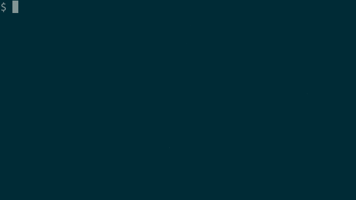

# peru [](https://github.com/buildinspace/peru/actions) [](https://badge.fury.io/py/peru)

##### Maybe sometimes better than copy-paste.

Peru is a tool for including other people's code in your projects. It
fetches from anywhere -- git, hg, svn, tarballs -- and puts files
wherever you like. Peru helps you track exact versions of your
dependencies, so that your history is always reproducible. And it fits
inside your scripts and [Makefiles](docs/make_examples), so your build
stays simple and foolproof.



## Why?

If you build with `make`, you don't have to do anything special when you
switch branches or pull new commits. Build tools notice those changes
without any help. But if you depend on other people's code, the tools
aren't so automatic anymore. You need to remember when to `git submodule
update` or `go get -u` or `pip install -r`. If you forget a step you can
break your build, or worse, you might build something wrong without
noticing.

Peru wants you to automate dependency management just like you automate
the rest of your build. It doesn't interfere with your source control or
install anything global, so you can just throw it in at the start of a
script and forget about it. It'll run every time, and your dependencies
will never be out of sync. Simple, and fast as heck.

The name "peru", along with our love for reproducible builds, was inspired by
[Amazon's Brazil build system](https://web.archive.org/web/20130731100223/http://stackoverflow.com/questions/3380795/what-does-amazon-use-for-its-build-and-release-system).
It also happens to be an anagram for "[reup](#magical-updates)".

## Installation

Peru supports Linux, macOS, and Windows. It requires:

* `python` 3.8 or later
* `git`, any version
* optionally, if you want fetch from these types of repos:
  * `hg`, any version
  * `svn`, any version

`git` is required even if you are not retrieving a git-based module because
Peru uses it internally.

### Using `pip`

Use [pip](https://pip.pypa.io/en/latest/) to install it:

```bash
pip install peru
```

Note that depending on how Python is set up on your machine, you might
need to use `sudo` with that, and Python 3's pip might be called `pip3`.

### Using OS package managers

On Arch Linux, you can install `peru` [from the
AUR](https://aur.archlinux.org/packages/peru).

Homebrew has a [Peru formula](https://formulae.brew.sh/formula/peru) for macOS
and Linux. `brew install peru` will install it running on the latest Python
version that Homebrew supports.

## Getting Started

Here's the peru version of the [first git submodules
example](http://git-scm.com/book/en/Git-Tools-Submodules#Starting-with-Submodules)
from the [Git Book](http://git-scm.com/book). We're going to add the Rack
library to our project. First, create a `peru.yaml` file like this:

```yaml
imports:
    rack_example: rack/  # This is where we want peru to put the module.

git module rack_example:
    url: git://github.com/chneukirchen/rack.git
```

Now run `peru sync`.

#### What the heck just happened?

Peru cloned Rack for you, and imported a copy of it under the `rack` directory.
It also created a magical directory called `.peru` to hold that clone and some
other business. If you're using source control, now would be a good time to put
these directories in your ignore list (like `.gitignore`). You usually don't
want to check them in.

Running `peru clean` will make the imported directory disappear.  Running `peru
sync` again will make it come back, and it'll be a lot faster this time,
because peru caches everything.

## Getting Fancy

For a more involved example, let's use peru to manage some dotfiles. We're big
fans of the [Solarized colorscheme](http://ethanschoonover.com/solarized), and
we want to get it working in both `ls` and `vim`. For `ls` all we need peru to
do is fetch a Solarized dircolors file. (That'll get loaded somewhere like
`.bashrc`, not included in this example.) For `vim` we're going to need the
[Solarized vim plugin](https://github.com/altercation/vim-colors-solarized),
and we also want [Pathogen](https://github.com/tpope/vim-pathogen), which makes
plugin installation much cleaner. Here's the `peru.yaml`:

```yaml
imports:
    # The dircolors file just goes at the root of our project.
    dircolors: ./
    # We're going to merge Pathogen's autoload directory into our own.
    pathogen: .vim/autoload/
    # The Solarized plugin gets its own directory, where Pathogen expects it.
    vim-solarized: .vim/bundle/solarized/

git module dircolors:
    url: https://github.com/seebi/dircolors-solarized
    # Only copy this file. Can be a list of files. Accepts * and ** globs.
    pick: dircolors.ansi-dark

curl module pathogen:
    url: https://codeload.github.com/tpope/vim-pathogen/tar.gz/v2.3
    # Untar the archive after fetching.
    unpack: tar
    # After the unpack, use this subdirectory as the root of the module.
    export: vim-pathogen-2.3/autoload/

git module vim-solarized:
    url: https://github.com/altercation/vim-colors-solarized
    # Fetch this exact commit, instead of master or main.
    rev: 7a7e5c8818d717084730133ed6b84a3ffc9d0447
```

The contents of the `dircolors` module are copied to the root of our repo. The
`pick` field restricts this to just one file, `dircolors.ansi-dark`.

The `pathogen` module uses the `curl` type instead of `git`, and its URL points
to a tarball. (This is for the sake of an example. In real life you'd probably
use `git` here too.) The `unpack` field means that we get the contents of the
tarball rather than the tarball file itself. Because the module specifies an
`export` directory, it's that directory rather than the whole module that gets
copied to the import path, `.vim/autoload`. The result is that Pathogen's
`autoload` directory gets merged with our own, which is the standard way to
install Pathogen.

The `vim-solarized` module gets copied into its own directory under `bundle`,
which is where Pathogen will look for it. Note that it has an explicit `rev`
field, which tells peru to fetch that exact revision, rather than the default
branch (`master` or `main` in git). That's a **Super Serious Best Practice™**,
because it means your dependencies will always be consistent, even when you
look at commits from a long time ago.

You really want all of your dependencies to have hashes, but editing
those by hand is painful. The next section is about making that easier.

## Magical Updates

If you run `peru reup`, peru will talk to each of your upstream repos, get
their latest versions, and then edit your `peru.yaml` file with any updates. If
you don't have `peru.yaml` checked into some kind of source control, you should
probably do that first, because the reup will modify it in place. When we reup
the example above, the changes look something like this:

```diff
diff --git a/peru.yaml b/peru.yaml
index 15c758d..7f0e26b 100644
--- a/peru.yaml
+++ b/peru.yaml
@@ -6,12 +6,14 @@ imports:
 git module dircolors:
     url: https://github.com/seebi/dircolors-solarized
     pick: dircolors.ansi-dark
+    rev: a5e130c642e45323a22226f331cb60fd37ce564f

 curl module pathogen:
     url: https://codeload.github.com/tpope/vim-pathogen/tar.gz/v2.3
     unpack: tar
     export: vim-pathogen-2.3/autoload/
+    sha1: 9c3fd6d9891bfe2cd3ed3ddc9ffe5f3fccb72b6a

 git module vim-solarized:
     url: https://github.com/altercation/vim-colors-solarized
-    rev: 7a7e5c8818d717084730133ed6b84a3ffc9d0447
+    rev: 528a59f26d12278698bb946f8fb82a63711eec21
```

Peru made three changes:
- The `dircolors` module, which didn't have a `rev` before, just got one. By
  default for `git`, this is the current `master` or `main`. To change that,
  you can set the `reup` field to the name of a different branch.
- The `pathogen` module got a `sha1` field. Unlike `git`, a `curl` module is
  plain old HTTP, so it's stuck downloading whatever file is at the `url`. But
  it will check this hash after the download is finished, and it will raise an
  error if there's a mismatch.
- The `vim-solarized` module had a hash before, but it's been updated. Again,
  the new value comes from `master` or `main` by default.

At this point, you'll probably want to make a new commit of `peru.yaml` to
record the version bumps. You can do this every so often to keep your plugins
up to date, and you'll always be able to reach old versions in your history.

## Commands
- `sync`
  - Pull in your imports. `sync` yells at you instead of overwriting existing
    or modified files. Use `--force`/`-f` to tell it you're serious.
- `clean`
  - Remove imported files. Same `--force`/`-f` flag as `sync`.
- `reup`
  - Update module fields with new revision information. For `git`, `hg`, and
    `svn`, this updates the `rev` field. For `curl`, this sets the `sha1`
    field. You can optionally give specific module names as arguments.
- `copy`
  - Make a copy of all the files in a module. Either specify a directory to put
    them in, or peru will create a temp dir for you. You can use this to see
    modules you don't normally import, or to play with different module/rule
    combinations (see "Rules" below).
- `override`
  - Replace the contents of a module with a local directory path, usually a
    clone you've made of the same repo. This lets you test changes to imported
    modules without needing to push your changes upstream or edit `peru.yaml`.

## Module Types

##### git, hg, svn
For cloning repos. These types all provide the same fields:
- `url`: required, any protocol supported by the underlying VCS
- `rev`: optional, the specific revision/branch/tag to fetch
- `reup`: optional, the branch/tag to get the latest rev from when running
  `peru reup`

The `git` type also supports setting `submodules: false` to skip
fetching git submodules. Otherwise they're included by default.

##### curl
For downloading a file from a URL. This type is powered by Pythons's standard
library, rather than an external program.
- `url`: required, any kind supported by `urllib` (HTTP, FTP, `file://`)
- `filename`: optional, overrides the default filename
- `sha1`: optional, checks that the downloaded file matches the checksum
- `unpack`: optional, `tar` or `zip`

Peru includes a few other types mostly for testing purposes. See `rsync` for an
example implemented in Bash.

## Creating New Module Types
Module type plugins are as-dumb-as-possible scripts that only know how to
sync, and optionally reup. Peru shells out to them and then handles most of
the caching magic itself, though plugins can also do their own caching as
appropriate.  For example, the git and hg plugins keep track of repos they
clone. Peru itself doesn't need to know how to do that. For all the details,
see [Architecture: Plugins](docs/architecture.md#plugins).

## Rules
Some fields (like `rev` and `unpack`) are specific to certain module
types. There are also fields you can use in any module, which modify the
tree of files after it's fetched. Some of these made an appearance in
the fancy example above:

- `copy`: A map or multimap of source and destination paths to copy.
  Works like `cp` on the command line, so if the destination is a
  directory, it'll preserve the source filename and copy into the
  destination directory.
- `move`: A map or multimap of source and destination paths to move.
  Similar to `copy` above, but removes the source.
- `drop`: A file or directory, or a list of files and directories, to
  remove from the module. Paths can contain `*` or `**` globs.
- `pick`: A file or directory, or a list of files and directories, to
  include in the module. Everything else is dropped. Paths can contain
  `*` or `**` globs.
- `executable`: A file or list of files to make executable, as if
  calling `chmod +x`. Also accepts globs.
- `export`: A subdirectory that peru should treat as the root of the
  module tree. Everything else is dropped, including parent directories.

Note that these fields always take effect in the order listed above, regardless
of the order they're given in `peru.yaml`. For example, a `move` is always
performed before a `pick`. Also note that these fields can't be given twice.
For example, instead of using two separate `move` fields (one of which would be
ignored), use a single `move` field containing multiple moves. In practice,
things work this way because these fields are parsed as keys in a dictionary,
which don't preserve ordering and can't repeat.

Besides using those fields in your modules, you can also use them in "named
rules", which let you transform one module in multiple ways. For example, say
you want the `asyncio` subdir from the Tulip project, but you also want the
license file somewhere else. Rather than defining the same module twice, you
can use one module and two named rules, like this:

```yaml
imports:
    tulip|asyncio: python/asyncio/
    tulip|license: licenses/

git module tulip:
    url: https://github.com/python/asyncio

rule asyncio:
    export: asyncio/

rule license:
    pick: COPYING
```

As in this example, named rules are declared a lot like modules and then
used in the `imports` list, with the syntax `module|rule`.  The `|`
operator there works kind of like a shell pipeline, so you can even do
twisted things like `module|rule1|rule2`, with each rule applying to the
output tree of the previous.

## Recursion

If you import a module that has a peru file of its own, peru can include
that module's imports along with it, similar to how git submodules
behave with `git clone --recursive`. To enable this, add `recursive:
true` in a module's definition.

It's also possible to directly import modules that are defined in the
`peru.yaml` file of another module. If your project defines a module
`foo`, and `foo` has a peru file in it that defines a module `bar`, you
can use `foo.bar` in your own imports. This works even if you never
actually import `foo`, and it does not require setting `recursive:
true`.

## Configuration

There are several flags and environment variables you can set, to
control where peru puts things. Flags always take precedence.

- `--file=<file>`: The path to your peru YAML file. By default peru
  looks for `peru.yaml` in the current directory or one of its parents.
  This setting tells peru to use a specific file. If set, `--sync-dir`
  must also be set.
- `--sync-dir=<dir>`: The path that all `imports` are interpreted
  relative to. That is, if you import a module to `./`, the contents of
  that module go directly in the sync dir. By default this is the
  directory containing your `peru.yaml` file. If set, `--file` must also
  be set.
- `--state-dir=<dir>`: The directory where peru stashes all of its state
  metadata, and also the parent of the cache dir. By default this is
  `.peru` inside the sync dir. You should not share this directory
  between two projects, or `peru sync` will get confused.
- `--cache-dir=<dir>` or `PERU_CACHE_DIR`: The directory where peru
  keeps everything it's fetched. If you have many projects fetching the
  same dependencies, you can use a shared cache dir to speed things up.
- `--file-basename=<name>`: Change the default peru file name (normally
  `peru.yaml`). As usual, peru will search the current directory and its
  parents for a file of that name, and it will use that file's parent
  dir as the sync dir. Incompatible with `--file`.

## Links
- [Discussion and announcements (Google
  Group)](https://groups.google.com/forum/#!forum/peru-tool)
- [Architecture doc](docs/architecture.md)
- [Using peru with make](docs/make_examples)
